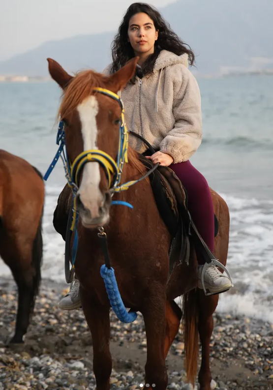

{fig-align="center"}

# Egitim

B.S., Food Engineering, Hacettepe University, Turkey, 2018 - 2022. 
M.S., Industrial Engineering, Hacettepe University, Turkey, 2026 - ongoing  

# Is Tecrubesi

## Employements

- Bahs., position Supply Chain Specialist, year 2025-2026
- Teaco & Bobaco, position Purchasing Specialist, year 2025
- Elite Naturel, position Business Development Specialist, year 2023-2024
- Patiswiss, position Project and Business Development Engineer, year 2022-2023

## Internships

- Firm Ulker, position Operational Excellence and Efficiency, year 2020
- Firm Ankara Halk Ekmek, position Food Engineer, year 2020

## Projects

EU Goals - Peynir Alti Suyundan Saccharomyces cerevisiae S288 Susu Kullanilarak Tek Hucre Proteini Uretimi

# Publications

## Karaca Dergisi

### Film incelemeleri
- Contact, Yonetmen: Robert Zemekis
- Blade Runner, Yonetmen: Ridley Scott
- Bos Ev, Yonetmen: Kim Ki-Duk
- Ben Efsaneyim, Yonetmen: Francis Lawrance

### Kitap Incelemeleri
- Dunyalar Savasi, Yazar: H.G Wells
- Ben Robot, Yazar: Isaac Asimov
- Kar, Yazar: Orhan Pamuk
- Anayurt Oteli, Yazar: Yusuf Atilgan

# Hobbies
- Yamac Parasutu
- Yelkencilik
- Binicilik
- Okculuk
- Dalis
- Fotografcilik
- Kus Gozlem
- Bahcecilik

# Iletisim

- [Mail](eyllaltiparmak@gmail.com)
- [Instagram](https://www.instagram.com/eylulaltiparmak/)

[CV'mi indir](https://github.com/emu-hacettepe-analytics/muy665-bahar2026-Eylul-Isil-Altiparmak/blob/main/MyWorks/EylulIsilAltiparmak_Cv_2025.pdf)